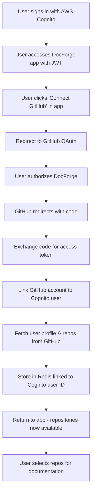

# Complete GitHub Integration Guide for DocForge (AWS Cognito + GitHub)

**Date:** July 23, 2025  
**Phase:** 2 - GitHub Integration as Additional Data Source  
**Implementation Type:** Frontend-First MVP → Backend Schema Definition → Production Deployment  
**Duration:** 1-2 weeks for complete implementation  
**Authentication:** AWS Cognito (Primary) + GitHub OAuth (Data Source Only)

## Table of Contents

1. [Overview & Architecture](#overview--architecture)
2. [GitHub OAuth App Setup](#github-oauth-app-setup)
3. [Backend Schema Design](#backend-schema-design)
4. [Postman Testing Strategy](#postman-testing-strategy)
5. [Backend Implementation](#backend-implementation)
6. [Frontend Integration](#frontend-integration)
7. [Security Implementation](#security-implementation)
8. [Production Deployment](#production-deployment)
9. [Troubleshooting Guide](#troubleshooting-guide)

---

## Overview & Architecture

### 🎯 Integration Goals

**Primary Objective:** Enable existing Cognito-authenticated users to connect their GitHub account (1:1 relationship) for automated repository documentation generation.

**Key Requirements:**
- **AWS Cognito Remains Primary Auth:** Users sign in with Cognito JWT - GitHub is additional data source only
- **Single GitHub Account per User:** Each DocForge user can connect exactly one GitHub account
- **Repository Selection:** Users choose which repositories to include in documentation
- **Minimal Server Requests:** Optimize for Cloudflare's 100k daily request limit
- **MVP-First Approach:** Build frontend to identify backend schemas, then implement backend
- **Security-First:** Implement OAuth 2.0 best practices from day one

### 🏗️ Architecture Flow



### 🔄 Data Flow Strategy

**Cognito + GitHub Integration Pattern:**
1. **Primary Authentication:** AWS Cognito handles all user authentication (sign-up, sign-in, JWT tokens)
2. **GitHub Connection:** Optional service integration for users who want GitHub repository access
3. **Data Linking:** GitHub data linked to Cognito user ID in backend storage
4. **Single Initial Load:** Astro catch-all loads user data + GitHub data (if connected) in one request
5. **Client-Side Mutations:** Repository selection handled by Qwik SPA
6. **Minimal Backend Requests:** Only GitHub connection and critical updates hit the server

---

## GitHub OAuth App Setup

### Step 1: Create GitHub OAuth Application

1. **Navigate to GitHub Developer Settings:**
   - Go to [GitHub.com](https://github.com)
   - Click your profile picture → Settings
   - Scroll down to "Developer settings" in left sidebar
   - Click "OAuth Apps"

2. **Create New OAuth App:**
   ```
   Application name: DocForge Dev
   Homepage URL: http://localhost:4321
   Application description: AI-powered documentation generation for GitHub repositories (connects to existing user accounts)
   Authorization callback URL: http://localhost:4321/auth/github/callback
   Enable Device Flow: DISABLED (not needed for web app)
   ```

3. **Environment-Specific Apps:**
   Create separate OAuth apps for each environment:
   - **Development:** 
     - Name: `DocForge Dev`
     - Homepage: `http://localhost:4321`
     - Callback: `http://localhost:4321/auth/github/callback`
   - **Staging:** 
     - Name: `DocForge Staging`
     - Homepage: `https://staging.docforge.com`
     - Callback: `https://staging.docforge.com/auth/github/callback`
   - **Production:** 
     - Name: `DocForge`
     - Homepage: `https://docforge.com`
     - Callback: `https://docforge.com/auth/github/callback`

### Important Notes:
- **Device Flow:** Keep DISABLED - you're building a web app, not a CLI tool
- **Callback URL:** Must be exact match - `/auth/github/callback` is handled by your Astro backend
- **Homepage URL:** Can be your local dev server for development

### Step 2: Obtain OAuth Credentials

After creating the OAuth app, you'll receive:

```bash
# These are YOUR GitHub OAuth App credentials
CLIENT_ID=Iv1.a1b2c3d4e5f6g7h8     # Public identifier
CLIENT_SECRET=a1b2c3d4e5f6g7h8i9j0k1l2m3n4o5p6q7r8s9t0  # SECRET - Never expose!
```

**Security Note:** The `CLIENT_SECRET` must NEVER be exposed in frontend code, environment files committed to git, or logs. It should only exist in:
- Backend environment variables
- Secure deployment configuration
- Encrypted secret management systems

### Step 3: OAuth Scope Configuration

**Required Scopes for DocForge:**
```javascript
const GITHUB_SCOPES = [
  'user:email',    // Access user's email address
  'repo',          // Access private and public repositories
  'read:user'      // Read user profile information
];

// Constructed OAuth URL
const oauthUrl = `https://github.com/login/oauth/authorize?` +
  `client_id=${CLIENT_ID}&` +
  `redirect_uri=${encodeURIComponent(CALLBACK_URL)}&` +
  `scope=${GITHUB_SCOPES.join(',')}&` +
  `state=${generateSecureState()}`;
```

**Scope Justifications:**
- `user:email`: Required to identify and contact users
- `repo`: Needed to access both public and private repositories for documentation
- `read:user`: Basic profile information for user display

### Step 4: Callback URL Configuration

**URL Pattern:**
```
https://your-domain.com/auth/github/callback
```

**Multiple Environment Support:**
```javascript
// Environment-specific callback URLs
const CALLBACK_URLS = {
  development: 'http://localhost:4321/auth/github/callback',
  staging: 'https://staging.docforge.com/auth/github/callback',
  production: 'https://docforge.com/auth/github/callback'
};
```

---

## Backend Schema Design

### Redis HSET Schema Architecture

**Design Philosophy:** Use Redis HSET structures for high-performance, atomic operations with built-in expiration management. **AWS Cognito handles user authentication - GitHub data is linked to Cognito users.**

### Cognito User + GitHub Integration Storage

```bash
# NO USER PROFILE STORAGE NEEDED - Cognito handles this!
# We only store GitHub integration data linked to Cognito user ID

# GitHub integration per Cognito user (main integration record)
HSET github_integration:{cognito_user_id}
  github_user_id "12345678"
  github_username "octocat"
  github_email "octocat@github.com"
  github_name "The Octocat"
  github_avatar_url "https://github.com/images/error/octocat_happy.gif"
  github_company "GitHub"
  github_location "San Francisco"
  github_bio "There once was..."
  github_public_repos "8"
  github_followers "20"
  github_following "0"
  access_token "{encrypted_with_aes256_gcm}"
  token_type "bearer"
  scope "repo,user:email,read:user"
  connected_at "1672444800"
  updated_at "1672444800"
  last_sync "1672444800"
  sync_status "completed"
  repos_count "25"

# Reverse lookup: GitHub user ID → Cognito user ID (prevent duplicate connections)
HSET github_to_cognito_lookup
  "12345678" "cognito_user_123-abc-456-def"  # Maps github_id to cognito_user_id

# NO SESSION MANAGEMENT NEEDED - Cognito JWT handles this!
```

### Repository Data Storage (Linked to Cognito Users)

```bash
# User's GitHub repositories (cached from API) - linked to Cognito user
HSET github_repos:{cognito_user_id}
  repo_count "25"
  last_sync "1672444800"
  sync_status "completed"
  private_count "5"
  public_count "20"
  total_stars "1250"
  primary_language "TypeScript"

# Individual repository data (shared across users if same repo)
HSET repo:{github_repo_id}
  github_id "123456789"
  name "Hello-World"
  full_name "octocat/Hello-World"
  description "This your first repo!"
  private "false"
  fork "false"
  language "C"
  stargazers_count "80"
  watchers_count "9"
  forks_count "9"
  size "108"  # KB
  default_branch "main"
  topics "octocat,atom,electron,api"
  created_at "2011-01-26T19:01:12Z"
  updated_at "2025-07-23T10:00:00Z"
  pushed_at "2025-07-23T09:30:00Z"
  clone_url "https://github.com/octocat/Hello-World.git"
  ssh_url "git@github.com:octocat/Hello-World.git"
  homepage "https://github.com"
  has_issues "true"
  has_projects "true"
  has_wiki "true"
  has_pages "false"
  archived "false"
  disabled "false"
  cached_at "1672444800"

# Repository ownership mapping (Cognito user → their repos)
HSET github_user_repos:{cognito_user_id}
  "123456789" "repo:123456789"  # Maps repo github_id to repo data key
  "234567890" "repo:234567890"
  "345678901" "repo:345678901"
  last_updated "1672444800"
  access_level "owner"  # owner, collaborator, etc.
```

### User Repository Selection (Cognito User Preferences)

```bash
# Repositories selected for documentation by Cognito user
HSET user_selected_repos:{cognito_user_id}
  "123456789" "selected"    # repo github_id → status
  "234567890" "selected"
  "345678901" "deselected"
  selection_count "2"
  last_updated "1672444800"
  auto_sync "true"  # Automatically include new repos

# Documentation generation status per Cognito user
HSET documentation_status:{cognito_user_id}
  "123456789" "completed"   # repo_id → status
  "234567890" "in_progress"
  "345678901" "queued"
  last_generated "1672444800"
  generation_count "15"
  docs_generated_today "3"
```

### Rate Limiting & API Usage (Per Cognito User)

```bash
# GitHub API rate limiting per Cognito user
HSET github_rate_limit:{cognito_user_id}
  remaining "4985"
  limit "5000"
  reset_at "1672448400"
  used_requests "15"
  last_request "1672444800"
  hourly_usage "25"

# DocForge API usage tracking per Cognito user
HSET api_usage:{cognito_user_id}:{date}  # date format: YYYY-MM-DD
  github_api_calls "25"
  documentation_generations "3"
  spa_loads "8"
  github_syncs "2"
  last_activity "1672444800"

# Global rate limiting (by IP) - for non-authenticated requests
HSET rate_limit:ip:{ip_address}:{window}
  requests "150"
  window_start "1672444800"
  window_end "1672448400"
```

### OAuth State Management (Temporary)

```bash
# OAuth state for GitHub connection flow (temporary, expires in 10 minutes)
HSET github_oauth_state:{state_uuid}
  cognito_user_id "cognito_user_123-abc-456-def"
  created_at "1672444800"
  expires_at "1672445400"  # 10 minutes later
  ip_address "192.168.1.1"
  user_agent "Mozilla/5.0..."
  flow_type "github_connect"  # vs "github_reconnect"

# OAuth state cleanup happens automatically via Redis TTL
EXPIRE github_oauth_state:{state_uuid} 600  # 10 minutes
```

### Token Encryption Implementation

```javascript
// AES-256-GCM Encryption for OAuth tokens
const crypto = require('crypto');

class GitHubTokenEncryption {
  constructor(encryptionKey) {
    this.algorithm = 'aes-256-gcm';
    this.key = Buffer.from(encryptionKey, 'hex'); // 32-byte key
    this.keyVersion = 'v1';
  }

  encrypt(plaintext) {
    const iv = crypto.randomBytes(12); // 96-bit IV for GCM
    const cipher = crypto.createCipheriv(this.algorithm, this.key, iv);
    
    let encrypted = cipher.update(plaintext, 'utf8', 'base64');
    encrypted += cipher.final('base64');
    
    const authTag = cipher.getAuthTag();
    
    return {
      ciphertext: encrypted,
      iv: iv.toString('base64'),
      authTag: authTag.toString('base64'),
      algorithm: this.algorithm,
      keyVersion: this.keyVersion
    };
  }

  decrypt(encryptedData) {
    const { ciphertext, iv, authTag, algorithm, keyVersion } = encryptedData;
    
    if (algorithm !== this.algorithm) {
      throw new Error(`Unsupported algorithm: ${algorithm}`);
    }
    
    if (keyVersion !== this.keyVersion) {
      throw new Error(`Unsupported key version: ${keyVersion}`);
    }
    
    const decipher = crypto.createDecipheriv(
      this.algorithm, 
      this.key, 
      Buffer.from(iv, 'base64')
    );
    
    decipher.setAuthTag(Buffer.from(authTag, 'base64'));
    
    let decrypted = decipher.update(ciphertext, 'base64', 'utf8');
    decrypted += decipher.final('utf8');
    
    return decrypted;
  }
}

// Usage example
const tokenEncryption = new GitHubTokenEncryption(process.env.TOKEN_ENCRYPTION_KEY);
const encryptedToken = tokenEncryption.encrypt('gho_xxxxxxxxxxxxxxxxxxxx');

// Store in Redis
await redis.hset(`github_oauth:${userId}`, {
  access_token: JSON.stringify(encryptedToken),
  token_type: 'bearer',
  // ... other fields
});
```

---

## Postman Testing Strategy

### Postman Collection Setup

**Collection 1: DocForge GitHub Integration Testing (Cognito + GitHub)**

```json
{
  "info": {
    "name": "DocForge GitHub Integration Testing",
    "description": "GitHub integration testing for Cognito-authenticated users",
    "schema": "https://schema.getpostman.com/json/collection/v2.1.0/collection.json"
  },
  "variable": [
    {
      "key": "GITHUB_CLIENT_ID",
      "value": "Iv1.your_client_id_here",
      "type": "string"
    },
    {
      "key": "GITHUB_CLIENT_SECRET", 
      "value": "your_client_secret_here",
      "type": "string"
    },
    {
      "key": "CALLBACK_URL",
      "value": "http://localhost:4321/auth/github/callback",
      "type": "string"
    },
    {
      "key": "BACKEND_URL",
      "value": "https://192.168.0.6:3000",
      "type": "string"
    },
    {
      "key": "COGNITO_JWT_TOKEN",
      "value": "your_cognito_jwt_token_here",
      "type": "string"
    },
    {
      "key": "COGNITO_USER_ID",
      "value": "cognito_user_123-abc-456-def",
      "type": "string"
    }
  ]
}
```

### Test 0: Initiate GitHub Connection (Cognito User)

**Purpose:** Start GitHub connection flow for already-authenticated Cognito user.  
**Method:** `GET`  
**URL:** `{{BACKEND_URL}}/auth/github/connect`  
**Headers:** `Authorization: Bearer {{COGNITO_JWT_TOKEN}}`

```javascript
// Pre-request Script - Extract Cognito user ID from JWT
const jwtToken = pm.collectionVariables.get('COGNITO_JWT_TOKEN');
if (jwtToken) {
  // Decode JWT payload (base64 decode middle part)
  const payload = JSON.parse(atob(jwtToken.split('.')[1]));
  pm.collectionVariables.set('COGNITO_USER_ID', payload.sub);
  console.log('🆔 Cognito User ID:', payload.sub);
  console.log('👤 Cognito Username:', payload['cognito:username'] || payload.username);
}

// Test Script
pm.test("GitHub connect initiated for Cognito user", function () {
    // This should redirect to GitHub OAuth with state parameter
    pm.expect(pm.response.code).to.be.oneOf([302, 200]);
    
    const location = pm.response.headers.get('Location');
    if (location) {
        pm.expect(location).to.include('github.com/login/oauth/authorize');
        pm.expect(location).to.include('client_id=');
        pm.expect(location).to.include('state=');
        
        // Extract state for later use
        const stateMatch = location.match(/state=([^&]+)/);
        if (stateMatch) {
            pm.collectionVariables.set('oauth_state', stateMatch[1]);
            console.log('🔐 OAuth state:', stateMatch[1]);
        }
        
        console.log('📋 Copy this URL to browser for GitHub OAuth:');
        console.log(location);
    }
});
```

### Test 1: OAuth Authorization URL Generation (Alternative Manual Method)

**Purpose:** Generate the correct OAuth URL manually if backend not ready.

```javascript
// Pre-request Script
const crypto = require('crypto');
const state = crypto.randomUUID();
pm.collectionVariables.set('oauth_state', state);

const scopes = ['repo', 'user:email', 'read:user'];
const authUrl = `https://github.com/login/oauth/authorize?` +
  `client_id=${pm.collectionVariables.get('GITHUB_CLIENT_ID')}&` +
  `redirect_uri=${encodeURIComponent(pm.collectionVariables.get('CALLBACK_URL'))}&` +
  `scope=${scopes.join(',')}&` +
  `state=${state}&` +
  `allow_signup=true`;

console.log('📋 Copy this URL to browser for manual OAuth flow:');
console.log(authUrl);
console.log('🆔 Associated with Cognito User:', pm.collectionVariables.get('COGNITO_USER_ID'));

// Test Script  
pm.test("OAuth URL generated successfully", function () {
    pm.expect(authUrl).to.include('github.com/login/oauth/authorize');
    pm.expect(authUrl).to.include('client_id=');
    pm.expect(authUrl).to.include('scope=repo');
});
```

### Test 2: Exchange Authorization Code for Access Token

**Method:** `POST`  
**URL:** `https://github.com/login/oauth/access_token`

```javascript
// Headers
{
  "Accept": "application/json",
  "Content-Type": "application/json",
  "User-Agent": "DocForge/1.0"
}

// Body (JSON)
{
  "client_id": "{{GITHUB_CLIENT_ID}}",
  "client_secret": "{{GITHUB_CLIENT_SECRET}}",
  "code": "{{AUTHORIZATION_CODE}}", // Manual input from callback URL
  "redirect_uri": "{{CALLBACK_URL}}",
  "state": "{{oauth_state}}"
}

// Test Script
pm.test("Token exchange successful", function () {
    pm.response.to.have.status(200);
    
    const responseJson = pm.response.json();
    pm.expect(responseJson).to.have.property('access_token');
    pm.expect(responseJson).to.have.property('token_type', 'bearer');
    pm.expect(responseJson).to.have.property('scope');
    
    // Store token for subsequent requests
    pm.collectionVariables.set('github_access_token', responseJson.access_token);
    pm.collectionVariables.set('github_token_scope', responseJson.scope);
    
    console.log('✅ Access token obtained:', responseJson.access_token.substring(0, 20) + '...');
    console.log('📋 Granted scopes:', responseJson.scope);
});

pm.test("Required scopes granted", function () {
    const responseJson = pm.response.json();
    const grantedScopes = responseJson.scope.split(',');
    
    pm.expect(grantedScopes).to.include('repo');
    pm.expect(grantedScopes).to.include('user:email');
    pm.expect(grantedScopes).
    console.log('🔐 All required scopes granted');
});
```

### Test 3: Fetch GitHub User Profile

**Method:** `GET`  
**URL:** `https://api.github.com/user`

```javascript
// Headers
{
  "Authorization": "Bearer {{github_access_token}}",
  "Accept": "application/vnd.github+json",
  "X-GitHub-Api-Version": "2022-11-28",
  "User-Agent": "DocForge/1.0"
}

// Test Script
pm.test("User profile retrieved successfully", function () {
    pm.response.to.have.status(200);
    
    const user = pm.response.json();
    pm.expect(user).to.have.property('id');
    pm.expect(user).to.have.property('login');
    pm.expect(user).to.have.property('email');
    pm.expect(user).to.have.property('avatar_url');
    
    // Store user data for backend testing
    pm.collectionVariables.set('github_user_id', user.id);
    pm.collectionVariables.set('github_login', user.login);
    pm.collectionVariables.set('github_email', user.email);
    
    console.log(`👤 User: ${user.login} (ID: ${user.id})`);
    console.log(`📧 Email: ${user.email}`);
    console.log(`🏢 Company: ${user.company || 'N/A'}`);
});

pm.test("Rate limit headers present", function () {
    pm.expect(pm.response.headers.get('x-ratelimit-limit')).to.not.be.null;
    pm.expect(pm.response.headers.get('x-ratelimit-remaining')).to.not.be.null;
    pm.expect(pm.response.headers.get('x-ratelimit-reset')).to.not.be.null;
    
    const remaining = pm.response.headers.get('x-ratelimit-remaining');
    const limit = pm.response.headers.get('x-ratelimit-limit');
    const reset = new Date(pm.response.headers.get('x-ratelimit-reset') * 1000);
    
    console.log(`🚦 Rate limit: ${remaining}/${limit} remaining`);
    console.log(`⏰ Reset at: ${reset.toISOString()}`);
});
```

### Test 4: Fetch User Repositories

**Method:** `GET`  
**URL:** `https://api.github.com/user/repos`

```javascript
// Query Parameters
{
  "per_page": "100",
  "sort": "updated",
  "direction": "desc",
  "type": "all"  // all, owner, public, private, member
}

// Test Script
pm.test("Repositories retrieved successfully", function () {
    pm.response.to.have.status(200);
    
    const repos = pm.response.json();
    pm.expect(repos).to.be.an('array');
    
    if (repos.length > 0) {
        const firstRepo = repos[0];
        pm.expect(firstRepo).to.have.property('id');
        pm.expect(firstRepo).to.have.property('name');
        pm.expect(firstRepo).to.have.property('full_name');
        pm.expect(firstRepo).to.have.property('private');
        pm.expect(firstRepo).to.have.property('language');
        
        console.log(`📚 Found ${repos.length} repositories`);
        console.log(`🔸 First repo: ${firstRepo.full_name} (${firstRepo.language || 'Unknown'})`);
        
        // Store sample repo for testing
        pm.collectionVariables.set('sample_repo_id', firstRepo.id);
        pm.collectionVariables.set('sample_repo_full_name', firstRepo.full_name);
    }
});

pm.test("Repository data structure correct", function () {
    const repos = pm.response.json();
    
    repos.forEach((repo, index) => {
        if (index < 5) { // Test first 5 repos
            pm.expect(repo).to.have.property('id');
            pm.expect(repo).to.have.property('name');
            pm.expect(repo).to.have.property('description');
            pm.expect(repo).to.have.property('stargazers_count');
            pm.expect(repo).to.have.property('language');
            pm.expect(repo).to.have.property('updated_at');
            pm.expect(repo.private).to.be.a('boolean');
        }
    });
    
    console.log('✅ Repository data structure validation passed');
});
```

### Test 5: Test Pagination (for users with many repos)

**Method:** `GET`  
**URL:** `https://api.github.com/user/repos`

```javascript
// Pre-request Script
let page = pm.collectionVariables.get('current_page') || 1;
pm.collectionVariables.set('current_page', page);

// Query Parameters
{
  "per_page": "30",
  "page": "{{current_page}}"
}

// Test Script
pm.test("Pagination headers present", function () {
    const linkHeader = pm.response.headers.get('link');
    
    if (linkHeader) {
        console.log('🔗 Link header:', linkHeader);
        
        // Parse pagination links
        const links = {};
        linkHeader.split(',').forEach(link => {
            const [url, rel] = link.split(';');
            const cleanUrl = url.trim().slice(1, -1); // Remove < >
            const relType = rel.match(/rel="([^"]+)"/)[1];
            links[relType] = cleanUrl;
        });
        
        pm.collectionVariables.set('pagination_links', JSON.stringify(links));
        
        if (links.next) {
            console.log('➡️ Next page available');
        }
        if (links.last) {
            console.log('🏁 Last page:', links.last);
        }
    }
});
```

---

## Backend Implementation

### OAuth Flow Endpoints

**File Structure:**
```
backend/
├── routes/
│   ├── auth.js          # GitHub OAuth routes (connect/disconnect)
│   └── api.js           # API routes (SPA load, etc.)
├── middleware/
│   ├── cognitoAuth.js   # Cognito JWT validation middleware
│   └── rateLimit.js     # Rate limiting
├── services/
│   ├── github.js        # GitHub API service
│   ├── redis.js         # Redis operations
│   ├── encryption.js    # Token encryption
│   └── cognito.js       # Cognito JWT validation service
└── config/
    └── oauth.js         # GitHub OAuth configuration
```

### OAuth Configuration

```javascript
// config/oauth.js
const OAUTH_CONFIG = {
  github: {
    clientId: process.env.GITHUB_CLIENT_ID,
    clientSecret: process.env.GITHUB_CLIENT_SECRET,
    authorizeUrl: 'https://github.com/login/oauth/authorize',
    tokenUrl: 'https://github.com/login/oauth/access_token',
    scopes: ['repo', 'user:email', 'read:user'],
    callbackUrl: process.env.GITHUB_CALLBACK_URL
  },
  
  cognito: {
    region: process.env.AWS_REGION,
    userPoolId: process.env.COGNITO_USER_POOL_ID,
    clientId: process.env.COGNITO_CLIENT_ID,
    jwtVerificationUrl: `https://cognito-idp.${process.env.AWS_REGION}.amazonaws.com/${process.env.COGNITO_USER_POOL_ID}/.well-known/jwks.json`
  },
  
  security: {
    stateExpiration: 600, // 10 minutes
    tokenEncryptionKey: process.env.TOKEN_ENCRYPTION_KEY
  },
  
  redis: {
    url: process.env.REDIS_URL,
    keyPrefix: 'docforge:',
    ttl: {
      githubOauthState: 600,    // 10 minutes
      githubIntegration: 31536000, // 1 year (or until disconnected)
      repoCache: 3600,          // 1 hour
      rateLimitWindow: 3600     // 1 hour
    }
  }
};

module.exports = OAUTH_CONFIG;
```

### Cognito Authentication Middleware

```javascript
// middleware/cognitoAuth.js
const jwt = require('jsonwebtoken');
const jwksClient = require('jwks-rsa');
const OAUTH_CONFIG = require('../config/oauth');

// Create JWKS client for Cognito JWT verification
const client = jwksClient({
  jwksUri: OAUTH_CONFIG.cognito.jwtVerificationUrl,
  cache: true,
  cacheMaxAge: 600000 // 10 minutes
});

function getKey(header, callback) {
  client.getSigningKey(header.kid, (err, key) => {
    const signingKey = key?.publicKey || key?.rsaPublicKey;
    callback(null, signingKey);
  });
}

/**
 * Validate Cognito JWT token
 */
const validateCognitoJWT = async (req, res, next) => {
  try {
    const authHeader = req.headers.authorization;
    
    if (!authHeader?.startsWith('Bearer ')) {
      return res.status(401).json({
        error: 'missing_token',
        message: 'Authorization header with Bearer token required'
      });
    }
    
    const token = authHeader.split(' ')[1];
    
    // Verify JWT with Cognito public keys
    const decoded = await new Promise((resolve, reject) => {
      jwt.verify(token, getKey, {
        issuer: `https://cognito-idp.${OAUTH_CONFIG.cognito.region}.amazonaws.com/${OAUTH_CONFIG.cognito.userPoolId}`,
        audience: OAUTH_CONFIG.cognito.clientId,
        algorithms: ['RS256']
      }, (err, decoded) => {
        if (err) reject(err);
        else resolve(decoded);
      });
    });
    
    // Extract Cognito user information
    req.cognitoUser = {
      id: decoded.sub,
      username: decoded['cognito:username'] || decoded.username,
      email: decoded.email,
      email_verified: decoded.email_verified,
      groups: decoded['cognito:groups'] || [],
      token_use: decoded.token_use,
      auth_time: decoded.auth_time,
      exp: decoded.exp
    };
    
    console.log(`✅ [Auth] Cognito user authenticated`, {
      userId: req.cognitoUser.id,
      username: req.cognitoUser.username,
      email: req.cognitoUser.email
    });
    
    next();
    
  } catch (error) {
    console.error('❌ [Auth] Cognito JWT validation failed:', error);
    res.status(401).json({
      error: 'invalid_token',
      message: 'Invalid or expired Cognito JWT token'
    });
  }
};

module.exports = { validateCognitoJWT };
```

### GitHub OAuth Route Implementation

```javascript
// routes/auth.js
const express = require('express');
const crypto = require('crypto');
const axios = require('axios');
const { RedisService } = require('../services/redis');
const { GitHubService } = require('../services/github');
const { TokenEncryption } = require('../services/encryption');
const { validateCognitoJWT } = require('../middleware/cognitoAuth');
const OAUTH_CONFIG = require('../config/oauth');

const router = express.Router();
const redis = new RedisService();
const github = new GitHubService();
const tokenEncryption = new TokenEncryption();

/**
 * Initiate GitHub connection for authenticated Cognito user
 * GET /auth/github/connect
 */
router.get('/github/connect', validateCognitoJWT, async (req, res) => {
  try {
    const cognitoUserId = req.cognitoUser.id;
    
    // Check if user already has GitHub connected
    const existingIntegration = await redis.hgetall(`github_integration:${cognitoUserId}`);
    if (existingIntegration.github_user_id) {
      console.log(`⚠️ [GitHub] User ${cognitoUserId} already has GitHub connected`);
      return res.redirect(`${process.env.FRONTEND_URL}/app/repositories?github_already_connected=true`);
    }
    
    // Generate secure state parameter linked to Cognito user
    const state = crypto.randomUUID();
    const stateExpiry = Math.floor(Date.now() / 1000) + OAUTH_CONFIG.security.stateExpiration;
    
    // Store state in Redis with Cognito user ID
    await redis.setWithExpiry(
      `github_oauth_state:${state}`, 
      JSON.stringify({ 
        cognito_user_id: cognitoUserId,
        created_at: Math.floor(Date.now() / 1000),
        expires_at: stateExpiry,
        ip: req.ip,
        user_agent: req.get('User-Agent'),
        flow_type: 'github_connect'
      }),
      OAUTH_CONFIG.redis.ttl.githubOauthState
    );
    
    // Build OAuth authorization URL
    const params = new URLSearchParams({
      client_id: OAUTH_CONFIG.github.clientId,
      redirect_uri: OAUTH_CONFIG.github.callbackUrl,
      scope: OAUTH_CONFIG.github.scopes.join(','),
      state: state,
      allow_signup: 'true'
    });
    
    const authUrl = `${OAUTH_CONFIG.github.authorizeUrl}?${params.toString()}`;
    
    console.log(`🚀 [GitHub] Initiating GitHub connection for Cognito user`, {
      cognitoUserId,
      state,
      ip: req.ip,
      userAgent: req.get('User-Agent')?.substring(0, 100)
    });
    
    res.redirect(authUrl);
    
  } catch (error) {
    console.error('❌ [GitHub] Failed to initiate GitHub connection:', error);
    res.status(500).json({ 
      error: 'github_connect_failed',
      message: 'Failed to initiate GitHub connection'
    });
  }
});

/**
 * Handle GitHub OAuth callback
 * GET /auth/github/callback
 */
router.get('/github/callback', async (req, res) => {
  const { code, state, error } = req.query;
  
  try {
    // Handle OAuth errors (user denied access, etc.)
    if (error) {
      console.warn(`⚠️ [OAuth] GitHub OAuth error: ${error}`, { 
        error_description: req.query.error_description 
      });
      
      return res.redirect(`${process.env.FRONTEND_URL}/auth/error?error=${error}`);
    }
    
    // Validate required parameters
    if (!code || !state) {
      console.error('❌ [OAuth] Missing required OAuth parameters', { code: !!code, state: !!state });
      return res.status(400).json({
        error: 'invalid_request',
        message: 'Missing required OAuth parameters'
      });
    }
    
    // Verify state parameter
    const storedStateData = await redis.get(`oauth_state:${state}`);
    if (!storedStateData) {
      console.error('❌ [OAuth] Invalid or expired OAuth state', { state });
      return res.status(400).json({
        error: 'invalid_state',
        message: 'Invalid or expired OAuth state parameter'
      });
    }
    
    // Clean up used state
    await redis.delete(`oauth_state:${state}`);
    
    console.log(`🔄 [OAuth] Processing OAuth callback`, { state, codeLength: code.length });
    
    // Exchange authorization code for access token
    const tokenResponse = await axios.post(OAUTH_CONFIG.github.tokenUrl, {
      client_id: OAUTH_CONFIG.github.clientId,
      client_secret: OAUTH_CONFIG.github.clientSecret,
      code: code,
      redirect_uri: OAUTH_CONFIG.github.callbackUrl,
      state: state
    }, {
      headers: {
        'Accept': 'application/json',
        'Content-Type': 'application/json',
        'User-Agent': 'DocForge/1.0'
      }
    });
    
    const { access_token, token_type, scope } = tokenResponse.data;
    
    if (!access_token) {
      console.error('❌ [OAuth] Failed to obtain access token', tokenResponse.data);
      return res.status(400).json({
        error: 'token_exchange_failed',
        message: 'Failed to exchange authorization code for access token'
      });
    }
    
    console.log(`✅ [OAuth] Access token obtained`, { 
      tokenType: token_type, 
      scopes: scope,
      tokenPrefix: access_token.substring(0, 10) + '...'
    });
    
    // Fetch user profile from GitHub
    const userProfile = await github.getUserProfile(access_token);
    console.log(`👤 [OAuth] User profile retrieved`, {
      githubId: userProfile.id,
      login: userProfile.login,
      email: userProfile.email
    });
    
    // Check if user already exists
    let userId = await redis.hget('github_user_lookup', userProfile.id.toString());
    
    if (!userId) {
      // Create new user
      userId = crypto.randomUUID();
      
      // Store user profile
      await redis.hset(`user:${userId}`, {
        github_id: userProfile.id.toString(),
        login: userProfile.login,
        email: userProfile.email || '',
        name: userProfile.name || '',
        avatar_url: userProfile.avatar_url || '',
        company: userProfile.company || '',
        location: userProfile.location || '',
        bio: userProfile.bio || '',
        public_repos: userProfile.public_repos.toString(),
        public_gists: userProfile.public_gists.toString(),
        followers: userProfile.followers.toString(),
        following: userProfile.following.toString(),
        created_at: Math.floor(Date.now() / 1000).toString(),
        updated_at: Math.floor(Date.now() / 1000).toString(),
        github_created_at: userProfile.created_at,
        github_updated_at: userProfile.updated_at
      });
      
      // Create lookup mapping
      await redis.hset('github_user_lookup', userProfile.id.toString(), userId);
      
      console.log(`🆕 [OAuth] New user created`, { userId, githubId: userProfile.id });
    } else {
      // Update existing user profile
      await redis.hset(`user:${userId}`, {
        login: userProfile.login,
        email: userProfile.email || '',
        name: userProfile.name || '',
        avatar_url: userProfile.avatar_url || '',
        company: userProfile.company || '',
        location: userProfile.location || '',
        bio: userProfile.bio || '',
        public_repos: userProfile.public_repos.toString(),
        public_gists: userProfile.public_gists.toString(),
        followers: userProfile.followers.toString(),
        following: userProfile.following.toString(),
        updated_at: Math.floor(Date.now() / 1000).toString(),
        github_updated_at: userProfile.updated_at
      });
      
      console.log(`🔄 [OAuth] Existing user updated`, { userId, githubId: userProfile.id });
    }
    
    // Encrypt and store OAuth token
    const encryptedToken = tokenEncryption.encrypt(access_token);
    await redis.hset(`github_oauth:${userId}`, {
      access_token: JSON.stringify(encryptedToken),
      token_type: token_type,
      scope: scope,
      granted_scopes: scope, // What GitHub actually granted
      created_at: Math.floor(Date.now() / 1000).toString(),
      updated_at: Math.floor(Date.now() / 1000).toString(),
      last_used: Math.floor(Date.now() / 1000).toString()
    });
    
    // Create user session
    const sessionId = crypto.randomUUID();
    await redis.setWithExpiry(
      `user_session:${sessionId}`,
      JSON.stringify({
        user_id: userId,
        github_id: userProfile.id.toString(),
        created_at: Math.floor(Date.now() / 1000),
        expires_at: Math.floor(Date.now() / 1000) + OAUTH_CONFIG.redis.ttl.userSession,
        ip_address: req.ip,
        user_agent: req.get('User-Agent')
      }),
      OAUTH_CONFIG.redis.ttl.userSession
    );
    
    // Set session cookie
    res.cookie('docforge_session', sessionId, {
      httpOnly: true,
      secure: process.env.NODE_ENV === 'production',
      sameSite: 'lax',
      maxAge: OAUTH_CONFIG.redis.ttl.userSession * 1000 // Convert to milliseconds
    });
    
    console.log(`🍪 [OAuth] User session created`, { sessionId, userId });
    
    // Redirect to frontend with success
    res.redirect(`${process.env.FRONTEND_URL}/auth/success?setup=github`);
    
  } catch (error) {
    console.error('❌ [OAuth] OAuth callback processing failed:', error);
    res.redirect(`${process.env.FRONTEND_URL}/auth/error?error=callback_processing_failed`);
  }
});

/**
 * Logout and revoke tokens
 * POST /auth/logout
 */
router.post('/logout', async (req, res) => {
  try {
    const sessionId = req.cookies.docforge_session;
    
    if (sessionId) {
      // Get session data
      const sessionData = await redis.get(`user_session:${sessionId}`);
      
      if (sessionData) {
        const session = JSON.parse(sessionData);
        const userId = session.user_id;
        
        // Clear OAuth token
        await redis.delete(`github_oauth:${userId}`);
        
        // Clear session
        await redis.delete(`user_session:${sessionId}`);
        
        console.log(`👋 [Auth] User logged out`, { userId, sessionId });
      }
    }
    
    // Clear session cookie
    res.clearCookie('docforge_session');
    
    res.json({ success: true, message: 'Logged out successfully' });
    
  } catch (error) {
    console.error('❌ [Auth] Logout failed:', error);
    res.status(500).json({ 
      error: 'logout_failed',
      message: 'Failed to logout user'
    });
  }
});

module.exports = router;
```

### GitHub API Service

```javascript
// services/github.js
const axios = require('axios');
const { TokenEncryption } = require('./encryption');

class GitHubService {
  constructor() {
    this.baseURL = 'https://api.github.com';
    this.tokenEncryption = new TokenEncryption();
  }

  /**
   * Create GitHub API client with access token
   */
  createClient(accessToken) {
    return axios.create({
      baseURL: this.baseURL,
      headers: {
        'Authorization': `Bearer ${accessToken}`,
        'Accept': 'application/vnd.github+json',
        'X-GitHub-Api-Version': '2022-11-28',
        'User-Agent': 'DocForge/1.0'
      }
    });
  }

  /**
   * Get user profile from GitHub API
   */
  async getUserProfile(accessToken) {
    const client = this.createClient(accessToken);
    
    try {
      const response = await client.get('/user');
      return response.data;
    } catch (error) {
      console.error('❌ [GitHub] Failed to fetch user profile:', error.response?.data || error.message);
      throw new Error('Failed to fetch user profile from GitHub');
    }
  }

  /**
   * Get user repositories with pagination
   */
  async getUserRepositories(accessToken, options = {}) {
    const client = this.createClient(accessToken);
    const {
      per_page = 100,
      sort = 'updated',
      direction = 'desc',
      type = 'all'
    } = options;

    try {
      let allRepos = [];
      let page = 1;
      let hasNextPage = true;

      while (hasNextPage && allRepos.length < 1000) { // Safety limit
        const response = await client.get('/user/repos', {
          params: {
            per_page,
            page,
            sort,
            direction,
            type
          }
        });

        const repos = response.data;
        allRepos.push(...repos);

        // Check for next page using Link header
        const linkHeader = response.headers.link;
        hasNextPage = linkHeader && linkHeader.includes('rel="next"');
        page++;

        console.log(`📚 [GitHub] Fetched page ${page - 1}, total repos: ${allRepos.length}`);
      }

      return allRepos;
    } catch (error) {
      console.error('❌ [GitHub] Failed to fetch repositories:', error.response?.data || error.message);
      throw new Error('Failed to fetch repositories from GitHub');
    }
  }

  /**
   * Get specific repository details
   */
  async getRepository(accessToken, owner, repo) {
    const client = this.createClient(accessToken);
    
    try {
      const response = await client.get(`/repos/${owner}/${repo}`);
      return response.data;
    } catch (error) {
      console.error(`❌ [GitHub] Failed to fetch repository ${owner}/${repo}:`, error.response?.data || error.message);
      throw new Error(`Failed to fetch repository ${owner}/${repo} from GitHub`);
    }
  }

  /**
   * Get repository contents for documentation generation
   */
  async getRepositoryContents(accessToken, owner, repo, path = '') {
    const client = this.createClient(accessToken);
    
    try {
      const response = await client.get(`/repos/${owner}/${repo}/contents/${path}`);
      return response.data;
    } catch (error) {
      console.error(`❌ [GitHub] Failed to fetch contents for ${owner}/${repo}:`, error.response?.data || error.message);
      throw new Error(`Failed to fetch repository contents from GitHub`);
    }
  }

  /**
   * Check rate limit status
   */
  async getRateLimit(accessToken) {
    const client = this.createClient(accessToken);
    
    try {
      const response = await client.get('/rate_limit');
      return response.data;
    } catch (error) {
      console.error('❌ [GitHub] Failed to fetch rate limit:', error.response?.data || error.message);
      throw new Error('Failed to fetch rate limit from GitHub');
    }
  }

  /**
   * Get decrypted access token for user
   */
  async getDecryptedToken(redis, userId) {
    try {
      const tokenData = await redis.hget(`github_oauth:${userId}`, 'access_token');
      
      if (!tokenData) {
        throw new Error('No GitHub token found for user');
      }

      const encryptedToken = JSON.parse(tokenData);
      const accessToken = this.tokenEncryption.decrypt(encryptedToken);
      
      return accessToken;
    } catch (error) {
      console.error('❌ [GitHub] Failed to decrypt access token:', error);
      throw new Error('Failed to decrypt GitHub access token');
    }
  }
}

module.exports = { GitHubService };
```

### SPA Data Load Endpoint

```javascript
// routes/api.js - SPA Load Endpoint
const express = require('express');
const { RedisService } = require('../services/redis');
const { GitHubService } = require('../services/github');
const auth = require('../middleware/auth');

const router = express.Router();
const redis = new RedisService();
const github = new GitHubService();

/**
 * Load all initial app data for SPA
 * GET /api/spa-load/app
 */
router.get('/spa-load/app', auth.requireAuth, async (req, res) => {
  const userId = req.user.id;
  
  try {
    console.log(`🔄 [SPA] Loading initial app data for user ${userId}`);
    
    // Get user profile
    const userProfile = await redis.hgetall(`user:${userId}`);
    
    if (!userProfile || !userProfile.github_id) {
      return res.status(404).json({
        error: 'user_not_found',
        message: 'User profile not found'
      });
    }

    // Get decrypted GitHub access token
    const accessToken = await github.getDecryptedToken(redis, userId);
    
    // Fetch fresh repositories from GitHub API
    console.log(`📚 [SPA] Fetching repositories for user ${userId}`);
    const githubRepos = await github.getUserRepositories(accessToken);
    
    // Cache repositories in Redis
    const repos = [];
    const repoOwnerMapping = {};
    
    for (const repo of githubRepos) {
      const repoData = {
        id: repo.id,
        name: repo.name,
        full_name: repo.full_name,
        description: repo.description || '',
        language: repo.language || 'Unknown',
        stargazers_count: repo.stargazers_count,
        watchers_count: repo.watchers_count,
        forks_count: repo.forks_count,
        size: repo.size,
        private: repo.private,
        fork: repo.fork,
        archived: repo.archived,
        disabled: repo.disabled,
        default_branch: repo.default_branch,
        topics: repo.topics?.join(',') || '',
        created_at: repo.created_at,
        updated_at: repo.updated_at,
        pushed_at: repo.pushed_at,
        clone_url: repo.clone_url,
        ssh_url: repo.ssh_url,
        homepage: repo.homepage || '',
        has_issues: repo.has_issues,
        has_projects: repo.has_projects,
        has_wiki: repo.has_wiki,
        has_pages: repo.has_pages,
        cached_at: Math.floor(Date.now() / 1000)
      };
      
      // Cache individual repo
      await redis.hset(`repo:${repo.id}`, repoData);
      
      // Add to owner mapping
      repoOwnerMapping[repo.id.toString()] = `repo:${repo.id}`;
      
      repos.push(repoData);
    }
    
    // Update repository ownership mapping
    await redis.hset(`repo_owners:${userId}`, {
      ...repoOwnerMapping,
      last_updated: Math.floor(Date.now() / 1000).toString()
    });
    
    // Update user repo count
    await redis.hset(`user_repos:${userId}`, {
      repo_count: githubRepos.length.toString(),
      last_sync: Math.floor(Date.now() / 1000).toString(),
      sync_status: 'completed',
      private_count: githubRepos.filter(r => r.private).length.toString(),
      public_count: githubRepos.filter(r => !r.private).length.toString()
    });
    
    // Get user's selected repositories
    const selectedReposData = await redis.hgetall(`user_selected_repos:${userId}`) || {};
    const selectedRepoIds = Object.keys(selectedReposData).filter(key => 
      key !== 'selection_count' && key !== 'last_updated' && key !== 'auto_sync' && 
      selectedReposData[key] === 'selected'
    );
    
    // Get documentation status
    const documentationStatusData = await redis.hgetall(`documentation_status:${userId}`) || {};
    const documentation = selectedRepoIds.map(repoId => {
      const repo = repos.find(r => r.id.toString() === repoId);
      if (!repo) return null;
      
      return {
        id: parseInt(repoId),
        repoName: repo.full_name,
        status: documentationStatusData[repoId] || 'not_started',
        lastUpdated: new Date().toISOString(), // TODO: Get actual last updated
        url: `/docs/${repo.full_name.replace('/', '-')}`
      };
    }).filter(Boolean);
    
    // Prepare response data
    const initialAppData = {
      repositories: repos.map(repo => ({
        id: repo.id,
        name: repo.name,
        description: repo.description,
        language: repo.language,
        stargazers_count: repo.stargazers_count,
        private: repo.private,
        updated_at: repo.updated_at
      })),
      documentation: documentation,
      user: {
        github_id: parseInt(userProfile.github_id),
        login: userProfile.login,
        email: userProfile.email,
        name: userProfile.name,
        avatar_url: userProfile.avatar_url,
        company: userProfile.company,
        location: userProfile.location,
        public_repos: parseInt(userProfile.public_repos),
        followers: parseInt(userProfile.followers),
        following: parseInt(userProfile.following)
      },
      stats: {
        total_repositories: repos.length,
        selected_repositories: selectedRepoIds.length,
        documentation_generated: documentation.filter(d => d.status === 'completed').length,
        last_sync: Math.floor(Date.now() / 1000)
      }
    };
    
    console.log(`✅ [SPA] Initial app data loaded successfully`, {
      userId,
      repositoriesCount: initialAppData.repositories.length,
      documentationCount: initialAppData.documentation.length,
      selectedRepos: selectedRepoIds.length
    });
    
    res.json(initialAppData);
    
  } catch (error) {
    console.error(`❌ [SPA] Failed to load initial app data for user ${userId}:`, error);
    
    // Return partial data if possible
    if (error.message.includes('GitHub')) {
      return res.status(503).json({
        error: 'github_api_unavailable',
        message: 'GitHub API is currently unavailable',
        repositories: [],
        documentation: [],
        user: null
      });
    }
    
    res.status(500).json({
      error: 'spa_load_failed',
      message: 'Failed to load initial app data'
    });
  }
});

module.exports = router;
```

---

## Frontend Integration

### OAuth Button Component

```jsx
// components/GitHubConnectButton.tsx
import { component$, useSignal, $ } from '@builder.io/qwik';

interface GitHubConnectButtonProps {
  isDark?: boolean;
  isConnected?: boolean;
  onConnect?: () => void;
}

export const GitHubConnectButton = component$<GitHubConnectButtonProps>(({ 
  isDark = false, 
  isConnected = false,
  onConnect 
}) => {
  const isLoading = useSignal(false);
  
  const handleConnect = $(async () => {
    if (isConnected) return;
    
    isLoading.value = true;
    
    try {
      // Trigger OAuth flow
      window.location.href = `${import.meta.env.VITE_API_URL}/auth/github`;
    } catch (error) {
      console.error('Failed to initiate GitHub connection:', error);
      isLoading.value = false;
    }
  });
  
  const buttonClasses = `
    flex items-center gap-3 px-6 py-3 rounded-lg font-medium transition-all duration-200
    ${isConnected 
      ? (isDark 
        ? 'bg-green-800 text-green-200 border border-green-600' 
        : 'bg-green-100 text-green-800 border border-green-300'
      )
      : (isDark
        ? 'bg-gray-800 hover:bg-gray-700 text-white border border-gray-600 hover:border-gray-500'
        : 'bg-white hover:bg-gray-50 text-gray-900 border border-gray-300 hover:border-gray-400'
      )
    }
    ${isLoading.value ? 'opacity-75 cursor-not-allowed' : 'cursor-pointer'}
  `;
  
  return (
    <button
      class={buttonClasses}
      onClick$={handleConnect}
      disabled={isLoading.value || isConnected}
    >
      {isLoading.value ? (
        <>
          <div class="w-5 h-5 border-2 border-current border-t-transparent rounded-full animate-spin"></div>
          <span>Connecting...</span>
        </>
      ) : isConnected ? (
        <>
          <svg class="w-5 h-5 text-green-500" fill="currentColor" viewBox="0 0 20 20">
            <path fill-rule="evenodd" d="M16.707 5.293a1 1 0 010 1.414l-8 8a1 1 0 01-1.414 0l-4-4a1 1 0 011.414-1.414L8 12.586l7.293-7.293a1 1 0 011.414 0z" clip-rule="evenodd"></path>
          </svg>
          <span>GitHub Connected</span>
        </>
      ) : (
        <>
          <svg class="w-5 h-5" fill="currentColor" viewBox="0 0 24 24">
            <path d="M12 0c-6.626 0-12 5.373-12 12 0 5.302 3.438 9.8 8.207 11.387.599.111.793-.261.793-.577v-2.234c-3.338.726-4.033-1.416-4.033-1.416-.546-1.387-1.333-1.756-1.333-1.756-1.089-.745.083-.729.083-.729 1.205.084 1.839 1.237 1.839 1.237 1.07 1.834 2.807 1.304 3.492.997.107-.775.418-1.305.762-1.604-2.665-.305-5.467-1.334-5.467-5.931 0-1.311.469-2.381 1.236-3.221-.124-.303-.535-1.524.117-3.176 0 0 1.008-.322 3.301 1.23.957-.266 1.983-.399 3.003-.404 1.02.005 2.047.138 3.006.404 2.291-1.552 3.297-1.23 3.297-1.23.653 1.653.242 2.874.118 3.176.77.84 1.235 1.911 1.235 3.221 0 4.609-2.807 5.624-5.479 5.921.43.372.823 1.102.823 2.222v3.293c0 .319.192.694.801.576 4.765-1.589 8.199-6.086 8.199-11.386 0-6.627-5.373-12-12-12z"/>
          </svg>
          <span>Connect GitHub</span>
        </>
      )}
    </button>
  );
});
```

### OAuth Callback Handler

```jsx
// pages/auth/success.tsx
import { component$, useVisibleTask$ } from '@builder.io/qwik';

export default component$(() => {
  useVisibleTask$(() => {
    // Get URL parameters
    const urlParams = new URLSearchParams(window.location.search);
    const setup = urlParams.get('setup');
    
    if (setup === 'github') {
      console.log('✅ GitHub OAuth completed successfully');
      
      // Redirect to repository selection after short delay
      setTimeout(() => {
        window.location.href = '/app/repositories';
      }, 2000);
    }
  });
  
  return (
    <div class="min-h-screen flex items-center justify-center bg-gray-50">
      <div class="max-w-md w-full bg-white rounded-lg shadow-lg p-8 text-center">
        <div class="w-16 h-16 bg-green-100 rounded-full flex items-center justify-center mx-auto mb-4">
          <svg class="w-8 h-8 text-green-500" fill="none" stroke="currentColor" viewBox="0 0 24 24">
            <path stroke-linecap="round" stroke-linejoin="round" stroke-width="2" d="M5 13l4 4L19 7"></path>
          </svg>
        </div>
        
        <h1 class="text-2xl font-bold text-gray-900 mb-2">GitHub Connected!</h1>
        <p class="text-gray-600 mb-6">
          Your GitHub account has been successfully connected to DocForge.
        </p>
        
        <div class="flex items-center justify-center gap-2 text-sm text-gray-500">
          <div class="w-4 h-4 border-2 border-blue-500 border-t-transparent rounded-full animate-spin"></div>
          <span>Redirecting to repository selection...</span>
        </div>
      </div>
    </div>
  );
});
```

### Error Handling Page

```jsx
// pages/auth/error.tsx
import { component$, useSignal, useVisibleTask$ } from '@builder.io/qwik';

export default component$(() => {
  const errorType = useSignal('');
  const errorMessage = useSignal('');
  
  useVisibleTask$(() => {
    const urlParams = new URLSearchParams(window.location.search);
    const error = urlParams.get('error');
    
    const errorMessages = {
      'access_denied': 'You denied access to DocForge. To use documentation features, please connect your GitHub account.',
      'invalid_request': 'Invalid OAuth request. Please try connecting again.',
      'invalid_state': 'Security validation failed. Please try connecting again.',
      'callback_processing_failed': 'Failed to process GitHub response. Please try again.',
      'token_exchange_failed': 'Failed to obtain access token from GitHub. Please try again.',
      'github_api_unavailable': 'GitHub API is currently unavailable. Please try again later.'
    };
    
    errorType.value = error || 'unknown';
    errorMessage.value = errorMessages[error as keyof typeof errorMessages] || 
      'An unexpected error occurred during GitHub connection.';
  });
  
  return (
    <div class="min-h-screen flex items-center justify-center bg-gray-50">
      <div class="max-w-md w-full bg-white rounded-lg shadow-lg p-8 text-center">
        <div class="w-16 h-16 bg-red-100 rounded-full flex items-center justify-center mx-auto mb-4">
          <svg class="w-8 h-8 text-red-500" fill="none" stroke="currentColor" viewBox="0 0 24 24">
            <path stroke-linecap="round" stroke-linejoin="round" stroke-width="2" d="M6 18L18 6M6 6l12 12"></path>
          </svg>
        </div>
        
        <h1 class="text-2xl font-bold text-gray-900 mb-2">Connection Failed</h1>
        <p class="text-gray-600 mb-6">{errorMessage.value}</p>
        
        <div class="space-y-3">
          <a 
            href="/auth/github" 
            class="block w-full bg-blue-600 hover:bg-blue-700 text-white font-medium py-2 px-4 rounded-lg transition-colors"
          >
            Try Again
          </a>
          <a 
            href="/" 
            class="block w-full bg-gray-100 hover:bg-gray-200 text-gray-700 font-medium py-2 px-4 rounded-lg transition-colors"
          >
            Back to Home
          </a>
        </div>
        
        {errorType.value === 'access_denied' && (
          <div class="mt-6 p-4 bg-blue-50 rounded-lg text-left">
            <h3 class="font-medium text-blue-900 mb-2">Why do we need GitHub access?</h3>
            <ul class="text-sm text-blue-800 space-y-1">
              <li>• Access your repositories for documentation generation</li>
              <li>• Read repository structure and code files</li>
              <li>• Sync repository updates automatically</li>
            </ul>
          </div>
        )}
      </div>
    </div>
  );
});
```

---

## Security Implementation

### Token Encryption Service

```javascript
// services/encryption.js
const crypto = require('crypto');

class TokenEncryption {
  constructor() {
    this.algorithm = 'aes-256-gcm';
    this.keyLength = 32; // 256 bits
    this.ivLength = 12; // 96 bits for GCM
    this.tagLength = 16; // 128 bits
    this.keyVersion = 'v1';
    
    // Get encryption key from environment
    this.encryptionKey = this.getEncryptionKey();
  }
  
  /**
   * Get encryption key from environment with validation
   */
  getEncryptionKey() {
    const key = process.env.TOKEN_ENCRYPTION_KEY;
    
    if (!key) {
      throw new Error('TOKEN_ENCRYPTION_KEY environment variable is required');
    }
    
    // Ensure key is proper length
    const keyBuffer = Buffer.from(key, 'hex');
    if (keyBuffer.length !== this.keyLength) {
      throw new Error(`Encryption key must be ${this.keyLength * 2} hex characters (${this.keyLength} bytes)`);
    }
    
    return keyBuffer;
  }
  
  /**
   * Encrypt plaintext using AES-256-GCM
   */
  encrypt(plaintext) {
    try {
      // Generate random IV
      const iv = crypto.randomBytes(this.ivLength);
      
      // Create cipher
      const cipher = crypto.createCipher(this.algorithm, this.encryptionKey, iv);
      
      // Encrypt
      let ciphertext = cipher.update(plaintext, 'utf8', 'base64');
      ciphertext += cipher.final('base64');
      
      // Get authentication tag
      const authTag = cipher.getAuthTag();
      
      return {
        ciphertext,
        iv: iv.toString('base64'),
        authTag: authTag.toString('base64'),
        algorithm: this.algorithm,
        keyVersion: this.keyVersion,
        encrypted_at: Math.floor(Date.now() / 1000)
      };
    } catch (error) {
      console.error('❌ [Encryption] Failed to encrypt token:', error);
      throw new Error('Failed to encrypt token');
    }
  }
  
  /**
   * Decrypt ciphertext using AES-256-GCM
   */
  decrypt(encryptedData) {
    try {
      const { ciphertext, iv, authTag, algorithm, keyVersion } = encryptedData;
      
      // Validate algorithm
      if (algorithm !== this.algorithm) {
        throw new Error(`Unsupported encryption algorithm: ${algorithm}`);
      }
      
      // Validate key version
      if (keyVersion !== this.keyVersion) {
        throw new Error(`Unsupported key version: ${keyVersion}`);
      }
      
      // Create decipher
      const decipher = crypto.createDecipher(
        this.algorithm, 
        this.encryptionKey, 
        Buffer.from(iv, 'base64')
      );
      
      // Set auth tag
      decipher.setAuthTag(Buffer.from(authTag, 'base64'));
      
      // Decrypt
      let plaintext = decipher.update(ciphertext, 'base64', 'utf8');
      plaintext += decipher.final('utf8');
      
      return plaintext;
    } catch (error) {
      console.error('❌ [Encryption] Failed to decrypt token:', error);
      throw new Error('Failed to decrypt token');
    }
  }
  
  /**
   * Generate new encryption key (for setup/rotation)
   */
  static generateKey() {
    return crypto.randomBytes(32).toString('hex');
  }
}

module.exports = { TokenEncryption };
```

### Authentication Middleware

```javascript
// middleware/auth.js
const { RedisService } = require('../services/redis');

const redis = new RedisService();

/**
 * Require valid authentication
 */
const requireAuth = async (req, res, next) => {
  try {
    // Check for session cookie
    const sessionId = req.cookies.docforge_session;
    
    if (!sessionId) {
      return res.status(401).json({
        error: 'authentication_required',
        message: 'Authentication required'
      });
    }
    
    // Get session data from Redis
    const sessionData = await redis.get(`user_session:${sessionId}`);
    
    if (!sessionData) {
      return res.status(401).json({
        error: 'invalid_session',
        message: 'Invalid or expired session'
      });
    }
    
    const session = JSON.parse(sessionData);
    
    // Check session expiration
    const now = Math.floor(Date.now() / 1000);
    if (session.expires_at < now) {
      // Clean up expired session
      await redis.delete(`user_session:${sessionId}`);
      
      return res.status(401).json({
        error: 'session_expired',
        message: 'Session has expired'
      });
    }
    
    // Update last activity
    session.last_activity = now;
    await redis.setWithExpiry(
      `user_session:${sessionId}`,
      JSON.stringify(session),
      session.expires_at - now
    );
    
    // Get user profile
    const userProfile = await redis.hgetall(`user:${session.user_id}`);
    
    if (!userProfile || !userProfile.github_id) {
      return res.status(401).json({
        error: 'user_not_found',
        message: 'User profile not found'
      });
    }
    
    // Attach user to request
    req.user = {
      id: session.user_id,
      github_id: session.github_id,
      login: userProfile.login,
      email: userProfile.email,
      session_id: sessionId
    };
    
    next();
    
  } catch (error) {
    console.error('❌ [Auth] Authentication middleware error:', error);
    res.status(500).json({
      error: 'authentication_error',
      message: 'Authentication system error'
    });
  }
};

/**
 * Optional authentication (user data if available)
 */
const optionalAuth = async (req, res, next) => {
  try {
    const sessionId = req.cookies.docforge_session;
    
    if (sessionId) {
      const sessionData = await redis.get(`user_session:${sessionId}`);
      
      if (sessionData) {
        const session = JSON.parse(sessionData);
        const now = Math.floor(Date.now() / 1000);
        
        if (session.expires_at >= now) {
          const userProfile = await redis.hgetall(`user:${session.user_id}`);
          
          if (userProfile && userProfile.github_id) {
            req.user = {
              id: session.user_id,
              github_id: session.github_id,
              login: userProfile.login,
              email: userProfile.email,
              session_id: sessionId
            };
          }
        }
      }
    }
    
    next();
    
  } catch (error) {
    console.error('❌ [Auth] Optional auth middleware error:', error);
    // Continue without authentication
    next();
  }
};

module.exports = {
  requireAuth,
  optionalAuth
};
```

### Rate Limiting Implementation

```javascript
// middleware/rateLimit.js
const { RedisService } = require('../services/redis');

const redis = new RedisService();

/**
 * Rate limiting middleware using sliding window
 */
const createRateLimit = (options = {}) => {
  const {
    windowMs = 60 * 1000,     // 1 minute window
    maxRequests = 100,        // Max requests per window
    keyGenerator = (req) => req.ip, // Default to IP-based limiting
    skipSuccessfulRequests = false,
    skipFailedRequests = false,
    message = 'Too many requests'
  } = options;

  return async (req, res, next) => {
    try {
      const key = `rate_limit:${keyGenerator(req)}`;
      const now = Date.now();
      const windowStart = now - windowMs;
      
      // Lua script for atomic sliding window rate limiting
      const luaScript = `
        local key = KEYS[1]
        local window_start = tonumber(ARGV[1])
        local now = tonumber(ARGV[2])
        local max_requests = tonumber(ARGV[3])
        
        -- Remove expired entries
        redis.call('ZREMRANGEBYSCORE', key, 0, window_start)
        
        -- Count current requests in window
        local current_requests = redis.call('ZCARD', key)
        
        if current_requests < max_requests then
          -- Add current request
          redis.call('ZADD', key, now, now)
          redis.call('EXPIRE', key, math.ceil(ARGV[4] / 1000))
          return {1, current_requests + 1, max_requests}
        else
          return {0, current_requests, max_requests}
        end
      `;
      
      const result = await redis.eval(luaScript, 1, key, windowStart, now, maxRequests, windowMs);
      const [allowed, currentRequests, limit] = result;
      
      // Set rate limit headers
      res.set({
        'X-RateLimit-Limit': limit,
        'X-RateLimit-Remaining': Math.max(0, limit - currentRequests),
        'X-RateLimit-Reset': new Date(now + windowMs).toISOString(),
        'X-RateLimit-Window': windowMs
      });
      
      if (!allowed) {
        return res.status(429).json({
          error: 'rate_limit_exceeded',
          message,
          retryAfter: Math.ceil(windowMs / 1000)
        });
      }
      
      // Store current request count for potential skip logic
      req.rateLimit = {
        current: currentRequests,
        limit,
        remaining: limit - currentRequests
      };
      
      next();
      
    } catch (error) {
      console.error('❌ [RateLimit] Rate limiting error:', error);
      // Fail open - allow request if rate limiting fails
      next();
    }
  };
};

/**
 * GitHub API rate limiting (separate limits)
 */
const githubApiRateLimit = createRateLimit({
  windowMs: 60 * 60 * 1000, // 1 hour window
  maxRequests: 4000,        // Conservative limit (GitHub allows 5000)
  keyGenerator: (req) => `github_api:${req.user?.id || req.ip}`,
  message: 'GitHub API rate limit exceeded'
});

/**
 * Authentication rate limiting (prevent brute force)
 */
const authRateLimit = createRateLimit({
  windowMs: 15 * 60 * 1000,  // 15 minute window
  maxRequests: 10,           // 10 auth attempts per window
  keyGenerator: (req) => `auth:${req.ip}`,
  message: 'Too many authentication attempts'
});

/**
 * General API rate limiting
 */
const apiRateLimit = createRateLimit({
  windowMs: 60 * 1000,  // 1 minute window
  maxRequests: 60,      // 60 requests per minute
  keyGenerator: (req) => `api:${req.user?.id || req.ip}`,
  message: 'API rate limit exceeded'
});

module.exports = {
  createRateLimit,
  githubApiRateLimit,
  authRateLimit,
  apiRateLimit
};
```

---

## Production Deployment

### Environment Configuration

```bash
# .env.production
NODE_ENV=production

# GitHub OAuth Configuration
GITHUB_CLIENT_ID=Iv1.your_production_client_id
GITHUB_CLIENT_SECRET=your_production_client_secret
GITHUB_CALLBACK_URL=https://docforge.com/auth/github/callback

# Security
TOKEN_ENCRYPTION_KEY=your_64_character_hex_encryption_key_here_32_bytes
SESSION_SECRET=your_session_secret_at_least_32_characters_long
JWT_SECRET=your_jwt_secret_at_least_32_characters_long

# Redis Configuration
REDIS_URL=redis://your-redis-instance:6379
REDIS_PASSWORD=your_redis_password
REDIS_TLS=true

# API Configuration
API_BASE_URL=https://api.docforge.com
FRONTEND_URL=https://docforge.com

# Cloudflare Configuration
CLOUDFLARE_ZONE_ID=your_zone_id
CLOUDFLARE_API_TOKEN=your_api_token

# Monitoring & Logging
LOG_LEVEL=info
SENTRY_DSN=your_sentry_dsn
ANALYTICS_API_KEY=your_analytics_key

# Rate Limiting
RATE_LIMIT_WINDOW_MS=60000
RATE_LIMIT_MAX_REQUESTS=100
GITHUB_API_RATE_LIMIT=4000
```

### Docker Configuration

```dockerfile
# Dockerfile
FROM node:18-alpine AS builder

WORKDIR /app

# Copy package files
COPY package*.json ./
RUN npm ci --only=production

# Copy source code
COPY . .

# Build application
RUN npm run build

# Production stage
FROM node:18-alpine AS production

WORKDIR /app

# Install security updates
RUN apk update && apk upgrade

# Create non-root user
RUN addgroup -g 1001 -S nodejs
RUN adduser -S docforge -u 1001

# Copy built application
COPY --from=builder --chown=docforge:nodejs /app/dist ./dist
COPY --from=builder --chown=docforge:nodejs /app/node_modules ./node_modules
COPY --from=builder --chown=docforge:nodejs /app/package.json ./package.json

# Switch to non-root user
USER docforge

# Health check
HEALTHCHECK --interval=30s --timeout=3s --start-period=5s --retries=3 \
  CMD curl -f http://localhost:3000/health || exit 1

EXPOSE 3000

CMD ["node", "dist/server.js"]
```

### Docker Compose for Development

```yaml
# docker-compose.yml
version: '3.8'

services:
  redis:
    image: redis:7-alpine
    ports:
      - "6379:6379"
    volumes:
      - redis_data:/data
    command: redis-server --appendonly yes --requirepass ${REDIS_PASSWORD}
    environment:
      - REDIS_PASSWORD=${REDIS_PASSWORD}
    healthcheck:
      test: ["CMD", "redis-cli", "--raw", "incr", "ping"]
      interval: 30s
      timeout: 3s
      retries: 5

  app:
    build: .
    ports:
      - "3000:3000"
    environment:
      - NODE_ENV=development
      - REDIS_URL=redis://redis:6379
      - REDIS_PASSWORD=${REDIS_PASSWORD}
      - GITHUB_CLIENT_ID=${GITHUB_CLIENT_ID}
      - GITHUB_CLIENT_SECRET=${GITHUB_CLIENT_SECRET}
      - TOKEN_ENCRYPTION_KEY=${TOKEN_ENCRYPTION_KEY}
      - SESSION_SECRET=${SESSION_SECRET}
    depends_on:
      redis:
        condition: service_healthy
    volumes:
      - ./logs:/app/logs
    healthcheck:
      test: ["CMD", "curl", "-f", "http://localhost:3000/health"]
      interval: 30s
      timeout: 3s
      retries: 3

volumes:
  redis_data:
```

### Cloudflare Workers Integration

```javascript
// cloudflare-worker.js
export default {
  async fetch(request, env, ctx) {
    const url = new URL(request.url);
    
    // Handle CORS for API requests
    if (request.method === 'OPTIONS') {
      return new Response(null, {
        headers: {
          'Access-Control-Allow-Origin': env.FRONTEND_URL,
          'Access-Control-Allow-Methods': 'GET, POST, PUT, DELETE, OPTIONS',
          'Access-Control-Allow-Headers': 'Content-Type, Authorization',
          'Access-Control-Max-Age': '86400'
        }
      });
    }
    
    // Proxy API requests to backend
    if (url.pathname.startsWith('/api/') || url.pathname.startsWith('/auth/')) {
      const backendUrl = `${env.BACKEND_URL}${url.pathname}${url.search}`;
      
      const modifiedRequest = new Request(backendUrl, {
        method: request.method,
        headers: request.headers,
        body: request.body
      });
      
      // Add rate limiting headers
      modifiedRequest.headers.set('CF-Connecting-IP', request.headers.get('CF-Connecting-IP'));
      modifiedRequest.headers.set('CF-Ray', request.headers.get('CF-Ray'));
      
      const response = await fetch(modifiedRequest);
      
      // Add CORS headers to response
      const modifiedResponse = new Response(response.body, response);
      modifiedResponse.headers.set('Access-Control-Allow-Origin', env.FRONTEND_URL);
      modifiedResponse.headers.set('Access-Control-Allow-Credentials', 'true');
      
      return modifiedResponse;
    }
    
    // Serve static assets from Cloudflare Pages
    return env.ASSETS.fetch(request);
  }
};
```

### CI/CD Pipeline (GitHub Actions)

```yaml
# .github/workflows/deploy.yml
name: Deploy to Production

on:
  push:
    branches: [main]
  pull_request:
    branches: [main]

jobs:
  test:
    runs-on: ubuntu-latest
    
    services:
      redis:
        image: redis:7-alpine
        ports:
          - 6379:6379
        options: >-
          --health-cmd "redis-cli ping"
          --health-interval 10s
          --health-timeout 5s
          --health-retries 5
    
    steps:
      - uses: actions/checkout@v3
      
      - name: Setup Node.js
        uses: actions/setup-node@v3
        with:
          node-version: '18'
          cache: 'npm'
      
      - name: Install dependencies
        run: npm ci
      
      - name: Run linting
        run: npm run lint
      
      - name: Run type checking
        run: npm run type-check
      
      - name: Run tests
        run: npm test
        env:
          REDIS_URL: redis://localhost:6379
          NODE_ENV: test
      
      - name: Run security audit
        run: npm audit --audit-level moderate

  deploy:
    needs: test
    runs-on: ubuntu-latest
    if: github.ref == 'refs/heads/main'
    
    steps:
      - uses: actions/checkout@v3
      
      - name: Setup Node.js
        uses: actions/setup-node@v3
        with:
          node-version: '18'
          cache: 'npm'
      
      - name: Install dependencies
        run: npm ci
      
      - name: Build application
        run: npm run build
      
      - name: Deploy to Cloudflare Pages
        uses: cloudflare/pages-action@v1
        with:
          apiToken: ${{ secrets.CLOUDFLARE_API_TOKEN }}
          accountId: ${{ secrets.CLOUDFLARE_ACCOUNT_ID }}
          projectName: docforge
          directory: dist
          gitHubToken: ${{ secrets.GITHUB_TOKEN }}
      
      - name: Deploy backend to production
        run: |
          # Deploy backend to your hosting platform
          # This could be Docker, Kubernetes, or serverless
          echo "Deploying backend..."
```

---

## Troubleshooting Guide

### Common OAuth Issues

#### 1. "Invalid redirect_uri" Error

**Symptoms:**
- Users see GitHub error page about invalid redirect URI
- OAuth flow fails immediately after GitHub authorization

**Causes:**
- Mismatch between configured callback URL and actual callback URL
- Missing HTTPS in production
- Incorrect domain configuration

**Solutions:**
```bash
# Check GitHub OAuth App settings
1. Go to GitHub → Settings → Developer settings → OAuth Apps
2. Verify "Authorization callback URL" exactly matches your implementation
3. Ensure production uses HTTPS: https://yourdomain.com/auth/github/callback
4. For development: http://localhost:4321/auth/github/callback

# Common mismatches:
❌ Configured: https://docforge.com/auth/callback
✅ Should be: https://docforge.com/auth/github/callback

❌ Configured: http://localhost:3000/auth/github/callback  
✅ Should be: http://localhost:4321/auth/github/callback (match your dev server)
```

#### 2. "State Parameter Mismatch" Error

**Symptoms:**
- Users get "invalid_state" error after GitHub authorization
- OAuth flow completes but callback fails

**Causes:**
- State parameter expired (Redis TTL too short)
- State parameter not properly stored
- Session/cookie issues

**Solutions:**
```javascript
// Debug state parameter handling
console.log('Generated state:', state);
console.log('Stored state in Redis:', await redis.get(`oauth_state:${state}`));
console.log('Received state from GitHub:', req.query.state);

// Increase state TTL if users are slow to authorize
const stateExpiry = 600; // 10 minutes (increase if needed)

// Check Redis connectivity
try {
  await redis.ping();
  console.log('✅ Redis connection healthy');
} catch (error) {
  console.error('❌ Redis connection failed:', error);
}
```

#### 3. Token Encryption/Decryption Failures

**Symptoms:**
- "Failed to decrypt token" errors
- Users need to re-authenticate frequently
- SPA load endpoint returns 401 errors

**Causes:**
- Missing or incorrect TOKEN_ENCRYPTION_KEY
- Key rotation without migration
- Corrupted encrypted data

**Solutions:**
```javascript
// Verify encryption key format
const key = process.env.TOKEN_ENCRYPTION_KEY;
console.log('Key length:', key?.length); // Should be 64 hex characters
console.log('Key valid hex:', /^[0-9a-fA-F]{64}$/.test(key)); // Should be true

// Generate new encryption key if needed
const crypto = require('crypto');
const newKey = crypto.randomBytes(32).toString('hex');
console.log('New encryption key:', newKey);

// Test encryption/decryption
const tokenEncryption = new TokenEncryption();
const testToken = 'gho_test_token_12345';
try {
  const encrypted = tokenEncryption.encrypt(testToken);
  const decrypted = tokenEncryption.decrypt(encrypted);
  console.log('✅ Encryption test passed:', decrypted === testToken);
} catch (error) {
  console.error('❌ Encryption test failed:', error);
}
```

### GitHub API Issues

#### 1. Rate Limit Exceeded

**Symptoms:**
- 403 errors from GitHub API
- "API rate limit exceeded" messages
- Repository data not loading

**Monitoring:**
```javascript
// Add rate limit monitoring
const response = await github.makeRequest('/user');
console.log('GitHub Rate Limit:', {
  limit: response.headers.get('x-ratelimit-limit'),
  remaining: response.headers.get('x-ratelimit-remaining'),
  reset: new Date(response.headers.get('x-ratelimit-reset') * 1000),
  used: response.headers.get('x-ratelimit-used')
});
```

**Solutions:**
```javascript
// Implement request queuing for rate limits
class GitHubRateLimiter {
  constructor() {
    this.queue = [];
    this.processing = false;
  }
  
  async enqueue(requestFn) {
    return new Promise((resolve, reject) => {
      this.queue.push({ requestFn, resolve, reject });
      this.processQueue();
    });
  }
  
  async processQueue() {
    if (this.processing || this.queue.length === 0) return;
    
    this.processing = true;
    
    while (this.queue.length > 0) {
      const { requestFn, resolve, reject } = this.queue.shift();
      
      try {
        const result = await requestFn();
        resolve(result);
        
        // Small delay to avoid hitting rate limits
        await new Promise(resolve => setTimeout(resolve, 100));
      } catch (error) {
        if (error.status === 403 || error.status === 429) {
          // Rate limited - wait and retry
          const resetTime = error.response?.headers?.get('x-ratelimit-reset');
          if (resetTime) {
            const waitTime = (parseInt(resetTime) * 1000) - Date.now();
            console.log(`⏱️ Rate limited, waiting ${waitTime}ms`);
            await new Promise(resolve => setTimeout(resolve, waitTime));
            
            // Re-queue the request
            this.queue.unshift({ requestFn, resolve, reject });
            continue;
          }
        }
        reject(error);
      }
    }
    
    this.processing = false;
  }
}
```

#### 2. Repository Access Issues

**Symptoms:**
- Private repositories not appearing
- "Not Found" errors for repositories that exist
- Incomplete repository data

**Debugging:**
```javascript
// Check granted scopes
const tokenData = await redis.hget(`github_oauth:${userId}`, 'granted_scopes');
console.log('Granted scopes:', tokenData);

// Verify required scopes are present
const requiredScopes = ['repo', 'user:email', 'read:user'];
const grantedScopes = tokenData.split(',');
const missingScopes = requiredScopes.filter(scope => !grantedScopes.includes(scope));

if (missingScopes.length > 0) {
  console.error('❌ Missing required scopes:', missingScopes);
  // Force re-authorization with correct scopes
}
```

### Redis Connection Issues

#### 1. Connection Timeouts

**Symptoms:**
- "ECONNREFUSED" errors
- Slow API responses
- Session data not persisting

**Solutions:**
```javascript
// Add Redis connection monitoring
const redis = new Redis(process.env.REDIS_URL, {
  retryStrategy: (times) => {
    const delay = Math.min(times * 50, 2000);
    console.log(`⏱️ Redis retry attempt ${times}, waiting ${delay}ms`);
    return delay;
  },
  maxRetriesPerRequest: 3,
  lazyConnect: true,
  keepAlive: 30000,
  connectTimeout: 10000,
  commandTimeout: 5000
});

redis.on('connect', () => console.log('✅ Redis connected'));
redis.on('error', (err) => console.error('❌ Redis error:', err));
redis.on('close', () => console.log('⚠️ Redis connection closed'));
redis.on('reconnecting', () => console.log('🔄 Redis reconnecting'));
```

#### 2. Memory Usage Issues

**Monitoring:**
```bash
# Monitor Redis memory usage
redis-cli info memory

# Check key expiration
redis-cli ttl oauth_state:some-state
redis-cli ttl user_session:some-session

# Find keys without expiration
redis-cli --scan --pattern "*" | xargs -I {} redis-cli ttl {} | grep -B1 "^-1$"
```

**Solutions:**
```javascript
// Set appropriate TTL values
const TTL_VALUES = {
  oauth_state: 600,        // 10 minutes
  user_session: 2592000,   // 30 days
  repo_cache: 3600,        // 1 hour
  rate_limit: 3600,        // 1 hour
  github_token: 31536000   // 1 year (or until revoked)
};

// Implement automatic cleanup
const cleanupExpiredKeys = async () => {
  const patterns = ['oauth_state:*', 'user_session:*', 'repo_cache:*'];
  
  for (const pattern of patterns) {
    const keys = await redis.keys(pattern);
    
    for (const key of keys) {
      const ttl = await redis.ttl(key);
      if (ttl === -1) { // No expiration set
        console.warn(`⚠️ Key without expiration: ${key}`);
        // Set default expiration based on key type
        await redis.expire(key, TTL_VALUES.user_session);
      }
    }
  }
};

// Run cleanup periodically
setInterval(cleanupExpiredKeys, 60 * 60 * 1000); // Every hour
```

### Performance Optimization

#### 1. Repository Data Caching

```javascript
// Implement intelligent caching
class RepositoryCache {
  constructor(redis) {
    this.redis = redis;
    this.cacheTTL = 3600; // 1 hour
  }
  
  async getRepositories(userId, forceRefresh = false) {
    const cacheKey = `repo_cache:${userId}`;
    
    if (!forceRefresh) {
      const cached = await this.redis.get(cacheKey);
      if (cached) {
        const data = JSON.parse(cached);
        console.log('✅ Repository data served from cache');
        return data;
      }
    }
    
    // Fetch fresh data from GitHub
    const accessToken = await github.getDecryptedToken(this.redis, userId);
    const repositories = await github.getUserRepositories(accessToken);
    
    // Cache the results
    await this.redis.setex(
      cacheKey, 
      this.cacheTTL, 
      JSON.stringify({
        repositories,
        cached_at: Date.now(),
        user_id: userId
      })
    );
    
    console.log('✅ Repository data cached for user', userId);
    return { repositories };
  }
}
```

#### 2. Request Deduplication

```javascript
// Prevent duplicate API calls
class RequestDeduplicator {
  constructor() {
    this.inflightRequests = new Map();
  }
  
  async deduplicate(key, requestFn) {
    if (this.inflightRequests.has(key)) {
      console.log('🔄 Request deduplicated:', key);
      return this.inflightRequests.get(key);
    }
    
    const promise = requestFn()
      .finally(() => {
        this.inflightRequests.delete(key);
      });
    
    this.inflightRequests.set(key, promise);
    return promise;
  }
}

// Usage
const deduplicator = new RequestDeduplicator();
const repositories = await deduplicator.deduplicate(
  `repos:${userId}`,
  () => github.getUserRepositories(accessToken)
);
```

### Security Monitoring

#### 1. Suspicious Activity Detection

```javascript
// Monitor for unusual patterns
const securityMonitor = {
  async checkSuspiciousActivity(userId, action, metadata = {}) {
    const events = await redis.lrange(`security_events:${userId}`, 0, 10);
    
    // Check for rapid successive logins
    if (action === 'login') {
      const recentLogins = events
        .filter(event => JSON.parse(event).action === 'login')
        .filter(event => Date.now() - JSON.parse(event).timestamp < 300000); // 5 minutes
      
      if (recentLogins.length > 5) {
        console.warn('🚨 Suspicious login activity detected:', {
          userId,
          recentLogins: recentLogins.length,
          metadata
        });
        
        // Rate limit or require additional verification
        return { suspicious: true, reason: 'rapid_logins' };
      }
    }
    
    // Log the event
    await redis.lpush(`security_events:${userId}`, JSON.stringify({
      action,
      timestamp: Date.now(),
      ip: metadata.ip,
      user_agent: metadata.userAgent,
      ...metadata
    }));
    
    // Keep only recent events
    await redis.ltrim(`security_events:${userId}`, 0, 50);
    
    return { suspicious: false };
  }
};
```

#### 2. Token Validation

```javascript
// Regular token health checks
const validateTokenHealth = async (userId) => {
  try {
    const accessToken = await github.getDecryptedToken(redis, userId);
    
    // Test token with a simple API call
    const response = await github.makeRequest('/user', accessToken);
    
    if (response.status === 401) {
      console.warn('⚠️ GitHub token expired or revoked for user:', userId);
      
      // Clear invalid token
      await redis.hdel(`github_oauth:${userId}`, 'access_token');
      
      // Notify user they need to re-authenticate
      await redis.hset(`user_notifications:${userId}`, {
        type: 'token_expired',
        message: 'GitHub connection expired. Please reconnect your account.',
        created_at: Date.now()
      });
      
      return { valid: false, reason: 'token_expired' };
    }
    
    // Update last validation timestamp
    await redis.hset(`github_oauth:${userId}`, {
      last_validated: Math.floor(Date.now() / 1000)
    });
    
    return { valid: true };
  } catch (error) {
    console.error('❌ Token validation failed:', error);
    return { valid: false, reason: 'validation_error' };
  }
};
```

---

## Conclusion

This comprehensive guide provides everything needed to implement a secure, scalable GitHub OAuth 2.0 integration for DocForge. The implementation follows these key principles:

### ✅ **Security First**
- AES-256-GCM token encryption
- PKCE-enhanced OAuth flow
- State parameter validation
- Rate limiting and abuse prevention
- Comprehensive security monitoring

### ✅ **Performance Optimized**
- Single initial data load strategy
- Intelligent caching with Redis HSET
- Request deduplication
- Efficient pagination handling
- Minimal Cloudflare server requests

### ✅ **Production Ready**
- Comprehensive error handling
- Monitoring and observability
- CI/CD pipeline integration
- Docker containerization
- Cloudflare Workers integration

### ✅ **Developer Experience**
- Extensive Postman testing collections
- Detailed troubleshooting guide
- Environment-specific configurations
- Clear documentation and code comments

### 🎯 **Next Steps**

1. **Week 1:** Set up GitHub OAuth App, implement Postman testing, create backend OAuth endpoints
2. **Week 2:** Integrate frontend components, implement SPA data loading, add error handling
3. **Week 3:** Security hardening, performance optimization, production deployment

The architecture is designed to scale from MVP to production while maintaining security best practices and optimal performance. The frontend-first approach allows rapid prototyping while the comprehensive backend schema provides a solid foundation for long-term growth.

**Remember:** Start with the Postman testing to understand the OAuth flow hands-on, then implement the backend endpoints, and finally integrate the frontend components. This incremental approach ensures each piece works correctly before moving to the next phase.